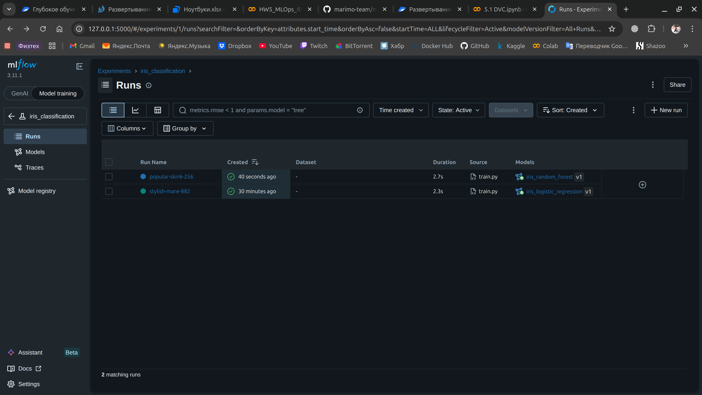
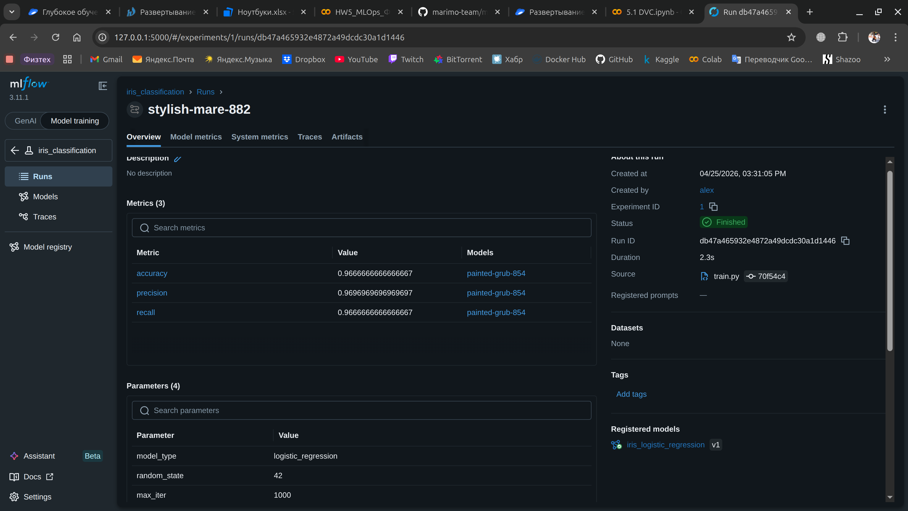
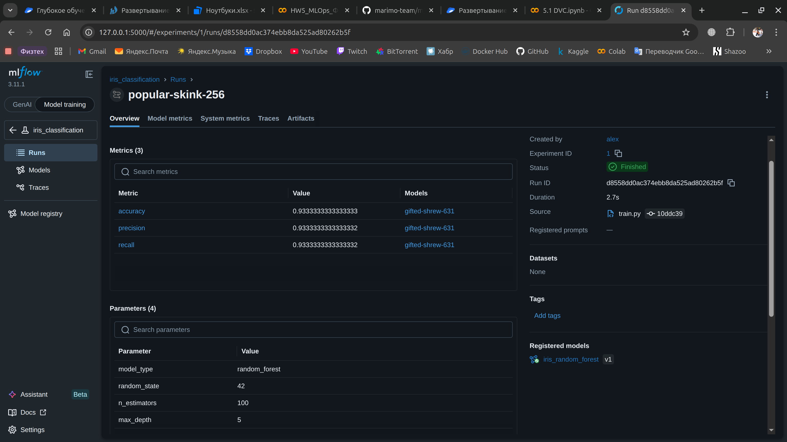

# Цель задания

Целью задания является построение минимального, но полноценного MLOps-контура, обеспечивающего:
- воспроизводимость экспериментов
- контроль версий данных и моделей
- автоматизацию процесса обучения и оценки модели
- документирование процесса через DVC и MLflow

## Как запустить проект

Последовательно выполнить следующие команды:
1. Клонирование репозитория и установка зависимостей в виртуальное окружение
```
git clone https://github.com/alexpunder/hw5_mlops_Litvinov_Alexandr.git

cd hw5_mlops_Litvinov_Alexandr

python3 -m venv venv

source venv/bin/activate

pip install -r requirements.txt
```
2. Инициализация локального хранилища DVC и подтягивание данных
```
dvc remote add -d myremote datasets -f

dvc pull
```
3. Запуск пайплайна (контроль параметров обучения реализован через файл `params.yaml`)
```
dvc repro
```

## Описание пайплайна

### data (Загрузка данных)
Загружает датасет Iris из библиотеки scikit-learn и сохраняет его в формате CSV в директорию `data/raw/`

### prepare (Подготовка данных)
Выполняет разделение данных на обучающую и тестовую выборки, базовую очистку и сохранение предобработанных данных в формате .npy в директорию `data/processed/`. Параметры разделения (test_size, random_state) управляются через `params.yaml`

### train (Обучение модели)
Обучает модель классификации (логистическая регрессия или случайный лес) на подготовленных данных, вычисляет метрики качества (accuracy, precision, recall) и сохраняет обученную модель в `models/model.pkl`, а метрики — в `metrics/train_metrics.json`. Тип модели задается в `params.yaml`

## UI MLflow
Выполните команду `mlflow ui --backend-store-uri sqlite:///mlflow.db` и перейдите по адресу `http://127.0.0.1:5000`  





# Выяснить ограничения традиционных ноутбуков Collab при разработке ML-систем по сравнению с Marimo

Сравнение `Marimo` и `Google Colab / Jupyter`:  
1. Воспроизводимость. В Colab ячейки можно запускать в любом порядке --> состояние расходится с кодом; в Marimo автоматические зависимости, перезапуск зависимых ячеек при изменении --> код всегда соответствует состоянию
2. Формат и конвертация. Colab - это огромный `JSON (.ipynb)`, в то время как Marimo - обычный `.py` файл, понятный любому IDE
3. Зависимости. Colab - ручной `!pip install` в ячейках, поэтому требуется читать код и устанавливать вручную; Marimo использует `PEP 723` + `uv`, зависимости внутри файла и создание автоматической изолированной среды
4. Динамические значения. Colab не перезапускает вычисления автоматически, в Marimo изменение параметра мгновенно пересчитывает графики и модели

# Обоснование готовности ML-системы к развертыванию в продуктивном окружении

Отчасти, система готова к развертыванию:
1. Есть воспроизводимость обучения благодаря `DVC` и фиксацции версий данных
2. Каждая модель имеет привязанные метрики, параметры и версию данных, логирование в `MLflow`
3. Пайплайн можно достаточно быстро интегрировать в `CI/CD`

Однако, все ещё не хватает важных компонентов, таких как: тестирование кода, мониторинга дрейфа данных и качества предсказаний, используется Pandas на игрушечном датасете, отсутствует контроль доступности remote-хранилища, не настроен полноценный CI/CD

# Разработать схему ML-системы для размытия (заблюривания) лиц на изображениях

Основные блоки на схеме:
1. `DVC` - версионирование данных
2. `MLflow` - логирование экспериментов и управление версиями моделей
3. `S3` - удаленное хранилище данных
4. `Prometheus+Grafana` - мониторинг


